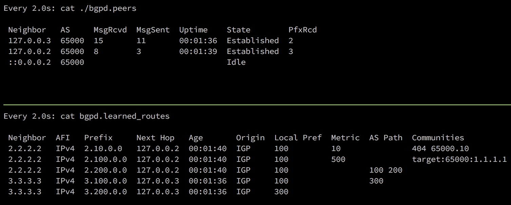

# BGPd-rs

BGP service daemon built in Rust

Totally just a POC, mostly for my own amusement


## Features
- [x] Listen for Incoming BGP sessions 
- [x] Parse OPEN, save capabilities
- [x] Send OPEN with capabilities 
- [x] Receive and respond to Keepalives
- [x] Attempt connection to unestablished peers
- [x] Process UPDATE messages, parsing with capabilities
- [x] Store received routes locally
- [ ] Advertise routes (specified somewhere?)
- [ ] API/CLI interface for viewing peer status, routes, etc.

# Peer config
Peers and their config are defined in `TOML` format; see an example [here](examples/config.toml).

Details of config values:
```
router_id = "1.1.1.1"       # Default Router ID for the service
default_as = 65000          # Used as the local-as if `local_as` is not defined for a peer

[[peers]]
remote_ip = "127.0.0.2"     # This can also be an IPv6 address, see next peer
remote_as = 65000
passive = true              # If passive, bgpd won't attempt outbound connections
router_id = "127.0.0.1"     # Can override local Router ID for this peer
hold_timer = 90             # Set the hold timer for the peer, defaults to 180 seconds

[[peers]]
remote_ip = "::2"
remote_as = 65000
local_as = 100
```

# View Peer Summary
By default peer info is output in the following files:
- Peer session summary: `./bgpd.peers`
- Learned routes: `./bgpd.learned_routes`

You can view current peer session status via these files:

```
[~/bgpd-rs/] $ cat ./bgpd.peers
Neighbor     AS     MsgRcvd  MsgSent  Uptime    State        PfxRcd
 ::0.0.0.2    65000  6        3        00:00:11  Established  0
 127.0.0.2    65000  0        0        ---       Idle         0
 172.16.20.1  65000  0        0        ---       Idle         0
 127.0.0.3    65000  0        0        ---       Idle         0
```
 > Tip: Use the `watch` command for keeping this view up-to-date



# Development
I'm currently using [ExaBGP](https://github.com/Exa-Networks/exabgp) (Python) to act as my BGP peer for testing.
- Here's an [intro article](https://thepacketgeek.com/influence-routing-decisions-with-python-and-exabgp/) about installing & getting started with ExaBGP.

## Testing Env setup
For ExaBGP I have the following files (in the examples/exabgp dir):

**conf_127.0.0.2.ini**
```ini
neighbor 127.0.0.1 {
# neighbor ::1 {   # Can use IPv6 also
    # local-address ::2;
    local-address 127.0.0.2;
    router-id 2.2.2.2;
    local-as 65000;
    peer-as 65000;
    # passive true;  // Uncomment to test active connections from bgpd

    capability {
        asn4 enable;
    }
    family {
        ipv4 unicast;
        ipv6 unicast;
    }

    announce {
        ipv4 {
            unicast 2.100.0.0/24 next-hop self;
            unicast 2.200.0.0/24 next-hop self;
        }
    }
}
```

Running the exabgp service with the command:

```
$ env exabgp.tcp.port=1179 exabgp.tcp.bind="127.0.0.2" exabgp ./conf_127.0.0.2.ini --once
```
> *--once only attempts a single connection, auto-quits when session ends*


And then running `bgpd` as follows:

Using IPv6
```
$ cargo run --  -a "::1" -p 1179 ./examples/config.toml -vv
```

or IPv4 (defaults to 127.0.0.1)
```
$ cargo run -- -p 1179 ./examples/config.toml -vv
```

You may notice that I'm using TCP port 1179 for testing, if you want/need to use TCP 179 for testing with a peer that can't change the port (*cough*Cisco*cough*), you need to run bgpd with sudo permissions:

```
$ cargo build
$ sudo ./targets/debug ./examples/config.toml -vv
```